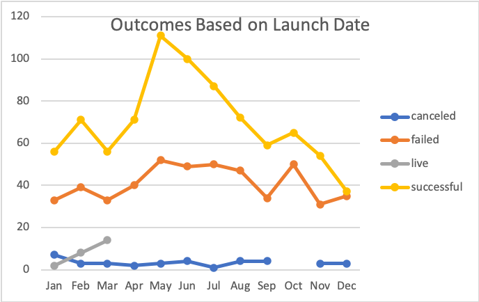
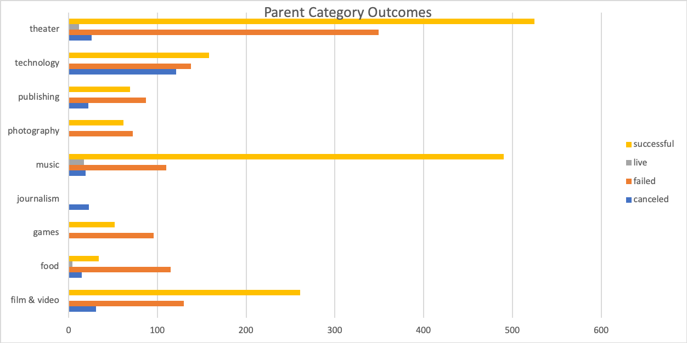
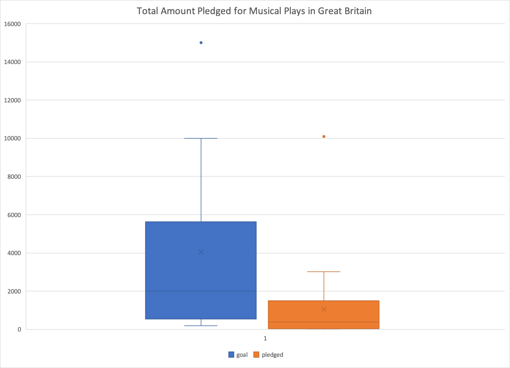

# An Analysis of Kickstarter Campaigns
An analysis on several thousand kickstarter projects to find trends in successful campaigns. The analysis focused on successful theatre kickstarter campaigns in the United States. 
On the Excel spreadsheet, you can easily view the outcomes of the Kickstarter campaigns with the applied color coding in the 'outcomes' column. The level of funding reached is visible in the 'percentage funded' column. The average donation for each campaign is calculated in the 'average donation' column. In looking at the data, there were 525 successful theatre campaigns in the United States. The timing of the campaigns were charted and found that May contained the most successful campaigns while December had the least. 
Five plays from Edinburgh were found in the Kickstarter data and analyzed in a separate sheet. 
The successful and failed United States play Kickstarter campaigns were analyzed to find the mean, median, standard deviation and IQR of the pledges and goals. These are reflected on the 'descriptive stats' sheet. The standard deviations are all roughly twice the IQR, except in failed Kickstarters the standard deviation was higher so there may be some high goals that resulted in failed Kickstarters.
For future projects, the goal amounts musical Kickstarter campaigns in Great Britain were analyzed. The distribution of the amounts is shown in the attached chart. 
Based on the analysis, a Kickstarter campaign for a play in the United States with a goal of close to $5,000 and launched in May will most likely be successful. 

